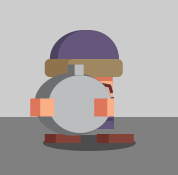

# When Mongols Are Your Neighbors post-mortem


## Concept

Before the competition began, I had been making loads of little single mechanic prototypes for the cool games I could possibly make this year. When the theme was announced however, none of my prototypes were a fit [grrr, github has no rage-quit emoji]. 

It took a long time to come up with an idea for a game (nearly five days!) but finally after a lot of research I figured since the Mongol empire played such a big part of the 13th century, it was only fitting that my game should feature them in a prominent role. 

A brief read about their influence on the 13th century revealed that the one thing the Mongol empire did very well was invade other nations, slaughtering everyone in their path, and that is when I thought... What would it be like if you lived next door to the Mongol empire? 

My first idea (which I stuck with) was that there would be a lone warrior facing an endless horde of mongol warriors, and decided that it would be a basic shooting game with a fixed screen, so no scrolling required. And I wanted blood! Lots and lots of blood!

<br>

## Requirements

After a bit of thinking I came up with the following requirements for the game:

- Simple defend against invaders mechanic. 

- Fixed screen game scene with no scrolling. 

- High res graphics. 

- Clickable powerups which spawn randomly on the screen. 

- Samurai positioned on right side of screen and moves up and down. 

- Multiple Mongol units with different attacks. 

- Mongols advance from left to right across the game scene. 

- Mongols inflict damage on Samurai if they pass him by. 

- Sound effects. 

- Ingame music. 

- Oceans of blood!

<br>

## Graphics

This year I wanted to use high resolution graphics again which meant using SVG images because they can be scaled up and down without losing fidelity. SVG images are thankfully also XML files that contain a lot of very similar strings which you can break down and recreate with code, thereby decreasing their size drastically. 

For example take the SVG head element, which all SVG images have. The following function returns a valid SVG head. You just pass it the dimensions of the image..

>```SVG_HEAD = (w, h) => `<svg width="${w}" height="${h}" version="1.1" viewBox="0 0 ${w} ${h}" xmlns="http://www.w3.org/2000/svg">`;```

Now consider the next function which can create most types of SVG rectangles you might ever need. It is also worth mentioning that by using the `rx` and `ry` parameters, the rectangle can be used to represent an ellipse as well!

>```SVG_RECT = (x, y, w, h, fill, rx = 0, ry = rx, strokeWidth = 0, stroke = '') => `<rect x="${x}" y="${y}" width="${w}" height="${h}" ${(SVG_FILTER_OR_FILL(fill))} rx="${rx}" ry="${ry}" stroke-width="${strokeWidth}" stroke="#${stroke}"/>`;```

Using these functions (and a few more) I was able to generate all of my SVG images in code. The strings produced were URI encoded and then drawn to an offscreen HTML Canvas which was used as a texture atlas (sprite-sheet) by the game engine. Here is that atlas...


I dunno what you think of this code generated atlas, but I'm very pleased at how it turned out and I'll probably use a more refined version next year too.

I learned a great deal about generating SVG images this year and discovered the magic of the SVG USE tag, which basically lets you reuse (or stamp) another shape over and over. It was used a bit when generating the bushes in the atlas above, and given more time I'd rewrite a lot more code to use this fantastic feature.

One of my early prototypes was a game called DeathMatch Dudes, a 2D Unreal Tournament 99 inspired deathMatch game using super blocky characters very similar to the ones from [GDevelop 2D Shooter Platform Example](https://wishforge.itch.io/gdevelop-2d-shooter-platformer-example), recreated painstakengly in InkScape and hand optimized in NotePad++.

Now about that abundance of blood...

Thinking back on aricles I read in the last few months, I remembered an interesting one at Smashing Magazine titled [The art of SVG filters and why it is awesome](https://www.smashingmagazine.com/2015/05/why-the-svg-filter-is-awesome/). The first filter made text look like water splashes, and with a bit of tweaking I managed to get it to look a bit like bloody text. Check out the differences between text appearance using no filter, a flat filter, and a lit filter (all using Arial font):

No filter


Flat filter


Lit filter


I eventually made some code that could generate these "bloody" filters on the fly, so all HTML elements and SVG objects could have the filter applied to them. I think this worked really well and next year I'll look at more SVG filtering. 

<br>

## Audio

This year I upgraded my version of [ZzFX](https://github.com/KilledByAPixel/ZzFX). In previous years when it plays a sound effect it plays the entire effect. This is generally what you would want except in the case where that same sound effect plays over and over in rapid succession, in which case there are many of the same sound effect playing at the same time and it sounds kind of crap.

The solution was to disconnect the `audioBufferSourceNode` from the `AudioContext` before playing the sound effect again, and the result works super well. 

I also wanted to have some music ingame this year but unfortunately I'm no good at making music and couldn't find anything remotely oriental for any mini sound players. So...

Mongols come in four varieties and are spawned randomly and I read somewhere that there are four musical notes (C2, D2, E2, and G2) which complement eachother. Every time a Mongol is spawned I update a note variable from 0-3, and then every .25 seconds, I play the corresponding note. The result is pretty random but it does sound better than cats screeching. I also play a hihat sound every .25 seconds, and a drum each second.

Even though I ended up being pleased with the random music, I wanted a nice plinking guitar type instrument for the notes to make it sound more oriental, but was unable to engineer one due to my limited abilities.

<br>

## Player

I was really pleased with how the Samurai character evolved from the initial [inspiration image](https://graphicriver.net/item/samurai-chibi-game-characters/20922721) I found by Segel2d..

 <table>
  <tr>
    <th>Inspiration</th>
    <th>Saumurai unarmed</th>
    <th>Samurai armed</th>
  </tr>

  <tr>
    <td></td>
    <td></td>
    <td></td>
  </tr>

</table> 

The samurai is armed with a large bamboo pipe weapon which fires just one type of projectile.

Originally I wated to add other projectile types but decided to stick with a single upgradable one, even though it has very limited upgradability.

<br>

## Enemies

After a load of searching I found some random internet images which gave me the inspiration for my Mongl units..

<table>

  <tr>
    <th>Random image 1</th>
    <th>Random image 2</th>
    <th>Base Mongol</th>
  </tr>

  <tr>
    <td></td>
    <td></td>
    <td></td>
  </tr>

</table> 

I created 6 Mongol enemies for the player to defeat, but only ended up using 5 of them. I was very pleased with how they turned out.

<table>

  <tr>
    <th>Enemy</th>
    <th>Image</th>
    <th>AI</th>
  </tr>

  <tr>
    <td>Swordsman</td>
    <td></td>
    <td>Swordsmen are the slowest moving Mongol. They throw their swords in the general direction of the Samurai which inflict low damage if they hit the player. Once they have thrown their swords, swordsmen become unarmed Mongols.</td>
  </tr>

  <tr>
    <td>Rammer</td>
    <td></td>
    <td>Rammers have a slow movement speed. They do not attack the Samurai directly but deal medium damage to him when they pass by.</td>
  </tr>

  <tr>
    <td>Spearman</td>
    <td></td>
    <td>Spearmen move at a medium speed across the field of battle. They throw their spears directly at the Samurai which inflict medium damage on him. Once their spear has been thrown, spearmen become unarmed Mongols.</td>
  </tr>

  <tr>
    <td>Bomber</td>
    <td></td>
    <td>Bombers move quickly. They are the fastest moving Mongol and inflict the most damage on the Samurai when they pass him. When defeated, the Bomber will explode showering his fellow Mongols with white hot shrapnel.</td>
  </tr>

  <tr>
    <td>Unarmed</td>
    <td></td>
    <td>Once a swordsman or spearman have thrown their wespon, they are mutated into an unarmed Mongol. Unarmed mongols do medium damage when they get past the Samurai's defences.</td>
  </tr>

  <tr>
    <td>Archer</td>
    <td></td>
    <td>The archer was not used in the game as it was too similar to the spearman and also it took more code to generate.</td>
  </tr>
</table> 

I was fairly happy with how the enemy units ended up but still feel that the rammer could have had some special kind of attack.

<br>

## Powerups

I ended up with 7 powerups that can be clicked on by the player. They are as follows:

<table>

  <tr>
    <th>Powerup</th>
    <th>Image</th>
    <th>Affect</th>
  </tr>

  <tr>
    <td>Health</td>
    <td></td>
    <td>Restores an amount of the samurai's health.</td>
  </tr>

  <tr>
    <td>Walkspeed</td>
    <td></td>
    <td>Increases the samurai's movement speed.</td>
  </tr>

  <tr>
    <td>Reload</td>
    <td></td>
    <td>BFG reloads faster.</td>
  </tr>

  <tr>
    <td>Speed</td>
    <td></td>
    <td>BFG projectiles move faster..</td>
  </tr>

  <tr>
    <td>Bombardment</td>
    <td></td>
    <td>Rains down bombs on the horde, obliterating them en masse.</td>
  </tr>

  <tr>
    <td>Lightning</td>
    <td></td>
    <td>Lightning strikes the horde from the heavens.</td>
  </tr>

  <tr>
    <td>RailGun</td>
    <td></td>
    <td>Annihilates all mongols within the its beam.</td>
  </tr>

  <tr>
    <td>Points</td>
    <td></td>
    <td>Awards 5,000 bonus points.</td>
  </tr>

</table> 

The powerup system worked pretty well and it adds more confusion and total randomness to the game.. just like real warfare I suppose.

<br>

## This years learnings and outcomes

- I ran out of time before I ran out of space to add more assets and features. This is because I spent only an hour or two most days working on my game. Next year I'll be going a bit harder to push the size limit.

- I learned a lot more about the inner working of SVG, and in particular discovered the amazing world of SVG filters... they are just fantastic and I'll be leveraging their power next year in a more intense way.

- I learned that tweaking SVG images by hand is very time consuming and that for next year I need to have a tool that does that for me.

- I had incredible issues making sound effects with ZzFX this year. I knew what sounds I wanted but clicking buttons to generate random sounds that were what I wanted was a waste of time. Also I'm no audio engineer so was unable to make any sounds myself. Next year I'll try and find a collaborator to do the sounds.

- I switched from HTML canvas rendering to a WebGL renderer, and the performance gain was tremendous, with no graphical lag in Chrome or Firefox on my laptop with crappy INTEL integrated graphics. I did use HTML canvas for the background where the blood splatters are placed however.

- I made my code fairly unreadable again! I apologize for this because every year it seems to get worse and worse. I think it's just the nature of the js13k competition.. to make code quite unreadable :D

<br>

## Conclusion

I expect people to play the game once or twice before discarding it. That's fine by me since this year my goals were to further refine my high res graphics system, and upgrade the rendering. Watch out next year when I'll work more on the actual game!

As always if you have any questions then raise a GitHub issue and I'll do my best to accomodate your requests :)

See you all next year!
